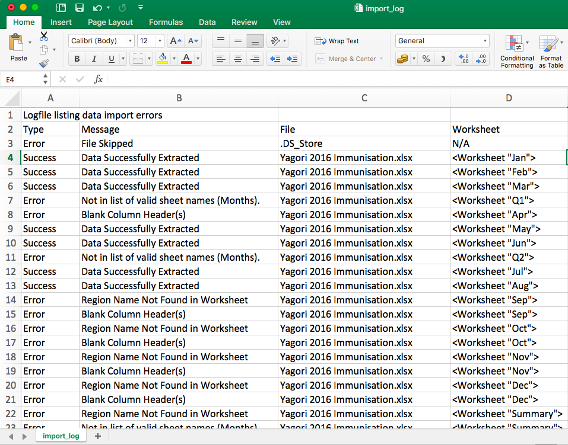
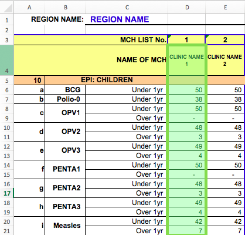
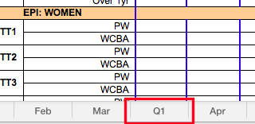
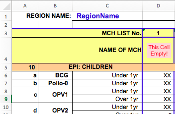
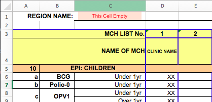

# Introduction
This repository contains a small collection of scripts for reading and compiling healthcare data.

## Contents
* Input Data Format
* Running the Tool
* Problems with the Data
* Notes on Software

## Task
Produce a tool to tidy up and compile a collection of Somali Healthcare Data into a master spreadsheet.
The tool must be easy to use and as robust as is sensible. It must be assumed that the end user *may* have limited computer skills and not be comfortable with python.

# Input Data Format
The input data used with this script are Excel documents. These documents are for a specific region. Within each document are worksheets for each month data is collected for, with rows of data items. There are several data columns in each worksheet, each containing data for a clinic within the region.

Example input data is included in this repository and can be found at: `Schema/Example 20xx Input.xlsx`

# Running the Tool

## Step 0 - Prepare the Tool
Double click on the `HealthcareProcessing.zip` file provided. Extract all the files to a location you wish to keep the tool.

Navigate to the folder where you extracted the files.

Check that everything is present. You should have a folder called HealthcareTool, within which is the following:
* A file called `Run.bat` - double click this to run the tool.

* A folder called `Input` - this is where you put the files you want to process. At present it contains three sets of example input data in folders. To run the tool on these you can copy them to the root of the `Input` Folder. The example datasets are called:
  - `Example Messy`
  - `Example Original`
  - `Example Tidy`

* A folder called `Output` - results will appear here once you run the tool.

* A folder called `Compiled_Windows` - leave this alone, it contains the code for the tool.
* A folder called `Python` - you can ignore this unless you are interested in modifying the tool :)

* A folder called `Schema` - you can ignore this folder. It contains data which the tool needs to run. This is both data on all the clinics in Somalia, as well as the structure of the input files to allow them to be read.

## Step 1 - Collect the Input Data

The tool operates the data found in the healthcare data spreadsheets which are in the `/Input` folder.

Collect the Excel healthcare data spreadsheets which you wish to produce a summary sheet for and put them in the `/Input` folder. Make sure that there are no other files in this folder.

Note that files in subdirectories are ignored by the tool. There are three example datasets in the n

Each time the tool is run, it re-scans all of the files in `/Input` so if you take a file out of the folder or delete it then it will no longer appear in the summary sheet.

## Step 2 - Run the Tool

Once all your files are in place, to run the tool, double click on the `Run.bat` file.

You should see a black window pop up, which will show the files which the tool is processing.

Once the tool is done this window will close. You can then navigate to the `/Output` folder.

In the output folder you should see:
* `clinicdata.json` - (Contains all the data in another format, you can ignore this.)
* `master_out.csv` - (The summary spreadsheet you want.)
* `import_log.csv` - (A log file describing where the data has successfully been extracted and where the tool has had problems.)

Check that the date on these files is the current time - i.e. check that they have just been made by the tool. If not, you have done something wrong!

## Step 3 - Look at the Log File

The log file (`import_log.csv`) lists the process the tool has gone through to try and generate the output spreadsheet. When you open it with Excel and resize the columns it looks like this:

Each row in the file shows:

* The type of message (Error / Success)
* A message
* The file which the message is about (if applicable)
* The worksheet which the message is about (if applicable)

### Types of message

Message  | Meaning  
--|--
File Skipped  |  The file did not have the extension `.xlsx` (and therefore could not be a valid set of data)
Data Successfully Extracted  |  A column of data was successfully taken from the Excel sheet and saved.  
Not in list of valid sheet names (Months).  |  The name of the worksheet was not a known month name - i.e. jan, feb, mar etc. so there is no way to know what month the data is for.!    
Blank Column Header(s)  | The cell at the top of a column of data is empty so there is no way to know which clinic it is for.  
Region Name Not Found In Worksheet  | The 'REGION NAME:' cell in the sheet is empty so the script doesnt know which region the data is for.  
Could Not Find Clinic Information  |  The clinic information in the Clinic Type, District,	Donor and	Est.Pop. columns is stored in an excel file in the Schema Folder. If this file cannot be found then these columns will not be filled in. Try doing Step 0 again.
Could Not Find Schema  |  The tool uses three schema files which tell it where to find the data in the input spreadsheets. If these schema files cannot be found then the tool cannot run. Try doing Step 0 again.

## Step 4 - Check the Output

Once the tool has run, you can look at the output summary sheet `master_out.csv`. You can open this in Excel to tidy up the formatting and do further work.

# Problems with the Data - (or why we have the log file)
There are multiple things about the way the data is captured which make it really tricky to clean and process it. The script does attempt to handle these. However, ultimately these issues limit how useful a programmatic approach to cleaning the data can be.

## Year Information
There is no year field in the templates, but there will be data from multiple years.
This means that the year data has to be extracted from the filename which is not particularly robust.

* The year information could easily be removed by renaming the file.
* The filename needs to be a consistent format to extract the year data from it. i.e. always 20XX or XX which is easy to forget.

## Template Inconsistency
There is inconsistency in the template which makes it hard to write rules to extract the data.

* The 'Region Name:' data is in D1 in the Safe Motherhood and OPD sheets, whilst it is in C1 in Immunisation
* Totals are in column 'F' in Immunisation, 'W' in Safe Motherhood and 'I' in OPD. (Are totals even used?)

## Input Inconsistency
There is inconsistency in the way the templates are filled out.
Where data items are missing:
* Sometimes the cells are left empty,
* Sometimes they are filled with a hyphen '-'
* Sometimes they are filled with a '0'

Sometimes there is data present in the column, but there is no 'Name of MCH' data in row 4.

The way missing months are represented varies.
* Sometimes there is a completely blank sheet
* Sometimes there is a sheet with nothing filled in

There are many variations on the spellings of single locations.

For example in the provided example files there are five different spellings of 'Yagori':
 * Yagori
 * Yogori
 * Yogroi
 * Yogri
 * Yagoori

This makes it difficult to group data appropriately, as well as making it tricky to do lookups against the name. I have decided not to add error handling for this because it encourages sloppy data input.

The questions are numbered / lettered in such a way that there is not a unique identifier for each question.
* For example in the OPD spreadsheets, does 4.3.4 refer to the Under 5 or Over 5 ARI Number?
* Further, some lists take the format 4.3.4, 4.3.5 while others are 10a, 10b etc.

The spreadsheets include numerous Merged cells which makes it harder to extract the labels for the data.
* To work around this the script uses manually edited schema files as a key to map data values to labels.

Fixing these issues with the data would be helpful going forwards!

# Notes on Software
These notes outline the structure of the scripts to assist anyone wanting to modify or expand upon them.

## Reading Excel Files Using Python
The people at http://www.python-excel.org recommends openpyxl for reading and writing Excel 2010 files.
This can be installed using `pip3 install openpyxl`.

Documentation at: https://openpyxl.readthedocs.org

## Fuzzy Matching for Clinic Names
Fuzzy matching for clinic names implemented using the following guide:
https://marcobonzanini.com/2015/02/25/fuzzy-string-matching-in-python/

Fuzzywuzzy package installed using `pip3 install fuzzywuzzy`.

## Code Structure
The scripts are comprised of 4 main files:
* Read_to_JSON.py
* Master_from_JSON.py
* Functions.py
* RunScript.py

These are described in the following sections.

### Read_to_JSON.py
Reads the files placed in ``/Input/``, saving the extracted data to `clinicdata.json` file stored
in ``/Output/``. It also creates a log file, stored in output showing the data which is successfully
imported and where errors have occured.

### Master_from_JSON.py
Reads the JSON and outputs `'master_out.csv'` which contains compiled healthcare information.

### Functions.py
Referenced by both Read_to_JSON.py and Master_from_JSON.py - contains functions used in both scripts

### RunScript.py
Wrapper function which calls Read_to_JSON.py, then Master_from_JSON.py. Effectively provides a single target for
pyinstaller without having to merge the three scripts.

## Compiling the scripts using PyInstaller
So that the end user does not need to install and configure python and the packages used by the scripts, these scripts
have been designed to be packaged using pyinstaller before distributing them.

To install pyinstaller (for python 3):

`pip3 install pyinstaller`

To package up the scripts:

`pyinstaller python/RunScript.py`

Note that pyinstaller produces a distributable version for the platform it is run from. I.e. you need to run it on windows
to generate a distributable for windows.
