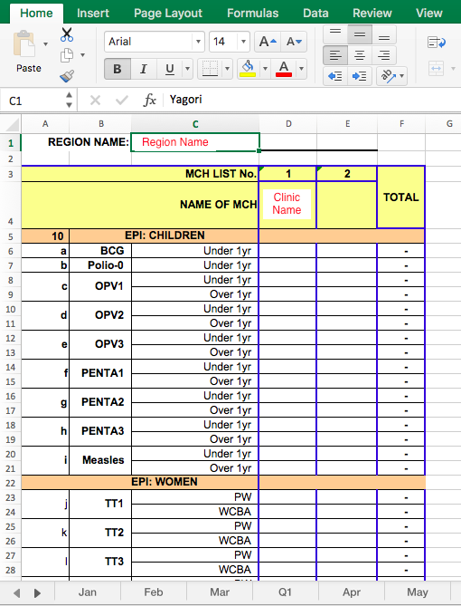

# Introduction
This repository contains a small collection of scripts for reading and compiling healthcare data.

## Task
Produce scripts to tidy up and compile a collection of Somali Healthcare Data.
The scripts must be easy to use and as robust as is sensible.

# Notes on Software
These notes outline the structure of the scripts to assist anyone wanting to modify or expand upon them
## Reading Excel Files Using Python
The people at http://www.python-excel.org recommends openpyxl for reading and writing Excel 2010 files.
This can be installed using `pip3 install openpyxl`.

Documentation at: https://openpyxl.readthedocs.org

## Code Structure
The scripts are comprised of 4 main files:
* Read_to_JSON.py
* Master_from_JSON.py
* Functions.py
* RunScript.py

These are described in the following sections.

### Read_to_JSON.py
Reads the files placed in ``/Input/``, saving the extracted data to `clinicdata.json` file stored
in ``/Output/``. It also creates a log file, stored in output showing the data which is successfully
imported and where errors have occured.

### Master_from_JSON.py
Reads the JSON and outputs `'master_out.csv'` which contains compiled healthcare information.

### Functions.py
Referenced by both Read_to_JSON.py and Master_from_JSON.py - contains functions used in both scripts

### RunScript.py
Wrapper function which calls Read_to_JSON.py, then Master_from_JSON.py. Effectively provides a single target for
pyinstaller without having to merge the three scripts.

## Compiling the scripts using PyInstaller
So that the end user does not need to install and configure python and the packages used by the scripts, these scripts
have been designed to be packaged using pyinstaller before distributing them.

To install pyinstaller (for python 3):

`pip3 install pyinstaller`

To package up the scripts:

`pyinstaller python/RunScript.py`

Note that pyinstaller produces a distributable version for the platform it is run from. I.e. you need to run it on windows
to generate a distributable for windows.

# Input Data

## Format
The input data used with this script is in Excel documents. These documents are for a specific region. Within each document are worksheets for each month, with rows of data. There are several data columns in each worksheet, each containing data for a clinic within the region.

## Problems with the Data
There are several things about the way the data is captured which present challenges when
attempting to clean and process it. The scripts attempt to handle these but ultimately these issues limit how useful a
programmatic approach to cleaning the data will be.

In no particular order:

1. There is no year field in the templates, but there will be data from multiple years.
This means that the year data has to be extracted from the filename which is not particularly robust.

* The year information could easily be removed by renaming the file.
* The filename needs to be a consistent format to extract the year data from it. i.e. always 20XX or XX which is easy to forget.

2. There is inconsistency in the template:

* The 'Region Name:' data is in D1 in the Safe Motherhood and OPD sheets, whilst it is in C1 in Immunisation
* Totals are in column 'F' in Immunisation, 'W' in Safe Motherhood and 'I' in OPD. (Are totals even used?)

3. There is inconsistency in the way the templates are filled out. Where data is missing,
* Sometimes the cells are left empty,
* Sometimes they are filled with a hyphen '-'
* Sometimes they are filled with a '0'
* Sometimes there is data present in the column, but there is no 'Name of MCH' data in row 4

4. The way missing months are represented varies.
* Sometimes there is a completely blank sheet
* Sometimes there is a sheet with nothing filled in

5. There are many variations on the spellings of single locations. This makes it difficult to group data appropriately,
as well as making it tricky to do lookups against the name. I have decided not to add error handling for this because it
encourages sloppy data input.

* For example in the provided example files there are five different spellings of 'Yagori':
 Yagori
 Yogori
 Yogroi
 Yogri
 Yagoori

6. The questions are numbered / lettered in such a way that there is not a unique identifier for each question.
* For example in the OPD spreadsheets, does 4.3.4 refer to the Under 5 or Over 5 ARI Number?
* Further, some lists take the format 4.3.4, 4.3.5 while others are 10a, 10b etc.

7. The spreadsheets include numerous Merged cells which makes it harder to extract the labels for the data.
* To work around this the script uses manually edited schema files as a key to map data values to labels.

# Running the Script

## Step 0 - Prepare the Tool
Double click on the `HealthcareProcessing.zip` file provided. Extract all the files to a location you wish to keep the tool.

Navigate to the folder where you extracted the files.

Check that everything is present. You should have

## Step 1 - Collect the Input Data

The tool operates the data found in the healthcare data spreadsheets which are in the `/Input` folder.

Collect the Excel healthcare data spreadsheets which you wish to produce a summary sheet for and put them in the `/Input` folder. Make sure that there are no other files in this folder.

Each time the tool is run, it re-scans all of the files in `/Input` so if you take a file out of the folder or delete it then it will no longer appear in the summary sheet.

## Step 2 - Run the Tool

Once all your files are in place, to run the tool, double click on the `SummariseData` shortcut.

You should see a black window pop up, which will show the files which the tool is processing.

Once the tool is done this window will close. You can then navigate to the `/Output` folder.

In the output folder you should see:
* `clinicdata.json` - (Contains all the data in another format, you can ignore this.)
* `master_out.csv` - (The summary spreadsheet you want.)
* `import_log.csv` - (A log file describing where the data has successfully been extracted and where the tool has had problems.)

Check that the date on these files is the current time - i.e. check that they have just been made by the tool. If not, you have done something wrong!

## Step 3 - Look at the Log File

The log file (`import_log.csv`) lists the process the tool has gone through to try and generate the output spreadsheet. When you open it with Excel and resize the columns it looks like this:
![Example of the Log File][logfile]

Each row in the file 

## Step 4 - Check the Output

Once the tool has run, you can look at the output summary

# Current Issues / To Do
These items are not presently handled by the script or are known problems.

* Handling of duplicate files - some error indication

* A lookup on clinic data - sponsor, population etc
* Add in a pointer to the filename for each item of data

* update year_from_fname to handle 20188 case (reports 2018 not error)

# MPM Tasks
Produce examples sheet showing examples of each error and how it can be fixed

Add exception for if the input directory is empty.

# Somalia Tasks
Clean Data as per the examples sheet

! List of images used above
[logfile]: https://raw.githubusercontent.com/mattmalcher/Healthcare-Data-Processing/master/Markdown_Images/ImportLog.png "Example Import Log"
